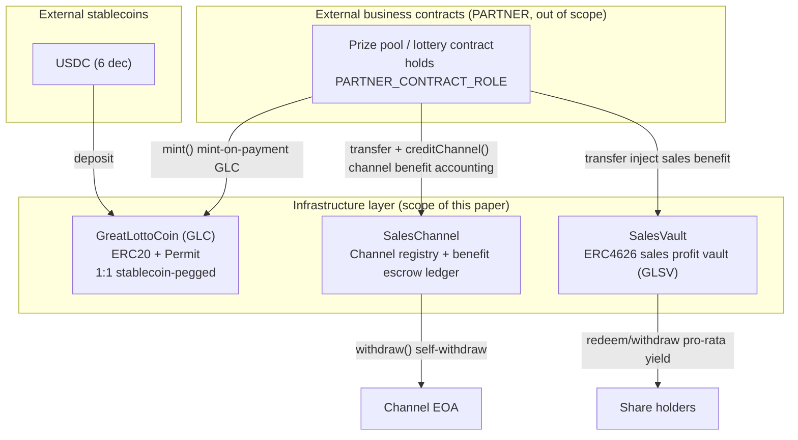

# GreatLottoGroup Infrastructure Contracts White Paper

| Item | Detail |
|---|---|
| Document version | v1.0 |
| Corresponding code version | `@greatlotto/infrastructure` v0.1.3 |
| Dependencies | OpenZeppelin Contracts v5.6.x |
| License | GPL-3.0 |
| Last updated | 2026-07-11 |

> **Scope**: This white paper focuses on the **three deployable top-level contracts** in the GreatLottoGroup
> infrastructure repository (`infrastructure`) — `GreatLottoCoin` (GLC), `SalesChannel`, and `SalesVault`.
> The abstract base layer (`PrizePoolBase` / `EntropyConsumerBase` / `AccessControlPartnerContract`, etc.) is
> described briefly as supporting mechanism where relevant, not as standalone sections. Downstream business
> contracts (lottery / prize pools) are referenced abstractly only as the "PARTNER caller"; their internal
> logic is out of scope for this document.

---

## Table of Contents

1. [Abstract](#1-abstract)
2. [Background & Motivation](#2-background--motivation)
3. [Design Goals & Principles](#3-design-goals--principles)
4. [System Architecture Overview](#4-system-architecture-overview)
5. [GreatLottoCoin (GLC) — Asset Coin](#5-greatlottocoin-glc--asset-coin)
6. [SalesChannel — Channel Registry & Benefit Escrow Ledger](#6-saleschannel--channel-registry--benefit-escrow-ledger)
7. [SalesVault — ERC-4626 Sales Profit Vault](#7-salesvault--erc-4626-sales-profit-vault)
8. [Economic Model](#8-economic-model)
9. [Security Model](#9-security-model)
10. [Governance](#10-governance)
11. [Risk Disclosure & Disclaimer](#11-risk-disclosure--disclaimer)
12. [Glossary](#12-glossary)

---

## 1. Abstract

GreatLottoGroup is an on-chain gaming/lottery platform built on Ethereum L2s (initially launching on Base and Arbitrum One). The **infrastructure contract layer** provides three reusable foundational capabilities for the platform:

- **Asset settlement coin (GreatLottoCoin, GLC)**: wraps external stablecoins (currently USDC) 1:1 by value into a unified platform accounting unit, shields business contracts from stablecoin differences, and constrains issuance with a "full collateralization" invariant;
- **Channel benefit escrow (SalesChannel)**: channels self-register on-chain, the platform escrows each channel's due revenue-share into the ledger, channels self-withdraw under a pull-payment model, and the ledger satisfies a strict solvency invariant;
- **Sales profit vault (SalesVault)**: an ERC-4626 yield vault into which platform sales revenue-share is injected directly, raising the net asset value (NAV) per share; share holders redeem their pro-rata GLC via the standard `redeem` / `withdraw`.

Together they form the platform's **fund-inflow → revenue-share → profit-distribution** foundation. Upper-layer business contracts (lottery / prize pools) call GLC's mint-on-payment and SalesChannel's benefit accounting via the `PARTNER_CONTRACT_ROLE` (granted only to contracts, never to EOAs), settling business income into auditable on-chain ledgers.

This document also details each contract's mechanism, economic model, security model, and governance boundaries, intended for technical due diligence, integrators, and pre-audit reading.

---

## 2. Background & Motivation

On-chain gaming / lottery businesses share three common pain points on the funds side; the infrastructure layer addresses each with a dedicated contract:

**1) Decoupling stablecoin settlement.** The platform uses external stablecoins (currently USDC, 6 decimals) as the deposit asset. If every business contract handled stablecoin decimal differences and approval paths directly, it would duplicate logic and enlarge the error surface. GLC decouples "which stablecoin is received" from "how the business accounts for it": the business side only faces a single 18-decimal GLC, stablecoin differences are consolidated in one place inside GLC, and the whitelist can be extended as needed.

**2) Trust and settlement of channel revenue-share.** The platform distributes business through sales channels, and channels need a benefit conduit that is **verifiable, non-repudiable, and requires no trust in the operator's manual payouts**. SalesChannel meets this with an on-chain ledger + pull-payment: once a revenue-share is credited, it becomes the channel's claim; the channel can withdraw at any time, and the operator cannot misappropriate or delay it.

**3) Sustainable distribution of platform profit.** The platform's retained sales profit needs a "holdable, appreciable, redeemable" vehicle rather than sitting in some operating account. SalesVault uses ERC-4626 to turn sales profit into vault NAV growth: shares are the yield-rights certificate, and redeeming realizes the value.

---

## 3. Design Goals & Principles

| Principle | How it is realized |
|---|---|
| **Full collateralization** | GLC issuance is predicated on actual receipt of underlying stablecoins; `recover()` can only mint excess collateral to the owner and never permits uncollateralized issuance. |
| **Least privilege + contract whitelist** | Sensitive entries such as minting / benefit accounting are granted only to `PARTNER_CONTRACT_ROLE`, and `grantRole` forces the grantee to be a contract (`code.length > 1000`), preventing EOAs from minting / accounting directly. |
| **Pull payment first** | Both channel revenue-share (SalesChannel) and vault yield (SalesVault) are actively withdrawn by beneficiaries, avoiding push-payment failures blocking the main flow and the risk surface of actively transferring to uncontrolled addresses. |
| **Strict fund invariants** | Every fund-holding contract maintains an off-chain-verifiable solvency invariant (see each chapter); transfers use "pre-balance check + post strict-equality check" to catch silent-fail and fee-on-transfer anomalous tokens. |
| **Minimized governance surface** | Mutable governance items are deliberately compressed: GLC has no pause / no blacklist; SalesChannel has no fund backdoor; SalesVault's only privilege is "minting shares within the hard cap." This reduces the blast radius of a misused / stolen governance key. |
| **Anti-delegatecall / anti-reentrancy** | Sensitive functions uniformly carry `noDelegateCall`; user entries involving external transfers carry `nonReentrant` as defense-in-depth. |
| **Standards first** | Reuse OpenZeppelin v5's ERC20 / ERC20Permit / ERC4626 / AccessControl / ReentrancyGuard / SafeERC20 as much as possible, reducing the attack surface of hand-rolled cryptography and state machines. |

---

## 4. System Architecture Overview

### 4.1 Contract Relationships



### 4.2 Responsibility Boundaries of the Three Contracts

| Contract | One-line responsibility | Holds funds? | Who can move its funds | How beneficiaries get paid |
|---|---|---|---|---|
| **GreatLottoCoin** | 1:1 stablecoin↔GLC wrapping and fully-collateralized issuance | Holds underlying stablecoins | PARTNER mints / any GLC holder redeems | `withdraw()` burns GLC for stablecoins |
| **SalesChannel** | Channel registry + channel benefit escrow ledger | Holds GLC | PARTNER credits via `creditChannel` | Channel `withdraw()` self-withdraw |
| **SalesVault** | ERC-4626 sales profit vault | Holds GLC | Anyone may `transfer` in (raises NAV) | Share holders `redeem`/`withdraw` |

### 4.3 Shared Base Components

The three contracts share a set of abstract bases / libraries (`contracts/base/`, `contracts/interfaces/`) that are prerequisites for understanding their security properties:

- **`AccessControlPartnerContract`**: `AccessControl` + `PARTNER_CONTRACT_ROLE`. At construction it grants `DEFAULT_ADMIN_ROLE` to `owner_` (falls back to the deployer if the zero address), and overrides `grantRole` — granting **any role** to the zero address reverts `ErrorZeroAddress`; only when granting `PARTNER_CONTRACT_ROLE` does it additionally require the target to be a contract (`_isContract`: `code.length > 1000`), otherwise `revert ErrorInvalidAddress`; other roles (including `DEFAULT_ADMIN_ROLE`) are exempt from the contract check and may be granted to EOAs / multisigs. This is the enforcement point for "sensitive entries grant contracts only, never EOAs."
- **`NoDelegateCall`**: records this contract's address at construction and compares at runtime, blocking `delegatecall` into sensitive functions (preventing storage / ledger tampering in a proxy context).
- **`DeadLine`**: the `checkDeadline(deadline)` modifier `revert`s an expired transaction, used on entries with user-signature / time-sensitive semantics.
- **`SelfPermit`**: EIP-2612 standard `permit` entries (`selfPermit` / `selfPermitIfNecessary`), letting an EOA complete "approve + call" in a single transaction.
- **`ReentrancyGuard` + `SafeERC20`** (OpenZeppelin): reentrancy protection and safe ERC20 interaction.

---

## 5. GreatLottoCoin (GLC) — Asset Coin

### 5.1 Positioning

GLC is the platform's **unified accounting / settlement asset coin**. It is a standard ERC-20 (with ERC-2612 Permit) token, symbol `GLC`, **18 decimals**. Its value peg is: **1 GLC = 1 unit of the underlying stablecoin** (e.g., 1 USDC). GLC itself bears no yield and is not re-collateralized; it only bears the duty of "converting and wrapping 6-decimal stablecoins into a single 18-decimal accounting unit."

Inheritance:
```
GreatLottoCoin is ERC20Permit, SelfPermit, AccessControlPartnerContract, NoDelegateCall, ReentrancyGuard, IGreatLottoCoin
```

### 5.2 Supported Underlying Stablecoin Whitelist

- The whitelist `_tokens` is injected via **constructor parameter**: `constructor(address[] tokensAddress_, address owner_)`. It is no longer hardcoded in source or switched per-network by comment — each chain fills in its stablecoin addresses in the deployment parameters (`supportedTokens` in `ignition/parameters/<network>.json`).
- Production currently supports **USDC** only.
- The `checkToken(address)` view verifies whether an address is on the whitelist; a non-whitelisted token in the deposit path directly `revert ErrorUnsupportedToken`.

> **Note**: The whitelist is fixed at construction; the contract has **no** runtime setter to add/remove stablecoins. Changing supported tokens requires redeploying GLC. This is part of the minimized governance surface.

### 5.3 Decimals & Conversion

GLC always accounts in 18 decimals, while underlying stablecoins are often 6. Three conversion helpers clarify the units:

| Function | Semantics | Formula |
|---|---|---|
| `getAmount(uint amount)` | integer "coin count" → GLC wei (18 dec) | `amount * 10**18` |
| `getAmount(address token, uint amount)` | integer "coin count" → that stablecoin's wei | `amount * 10**token.decimals()` (e.g., `amount*1e6` for USDC) |
| `getAmountWithDecimals(address token, uint amount)` | stablecoin wei balance → converted to GLC wei | `amount * 10**(18 - token.decimals())` (`*1e12` for USDC) |

That is: the caller works in units of "integer coin count `amount`", and the contract derives the underlying stablecoin amount to receive and the GLC amount to mint separately — the two are equal in value, differing only in precision.

### 5.4 Core Mechanisms

#### (1) Mint-on-payment `mint` (PARTNER only)

```solidity
function mint(address token, uint256 amount, address payer) external onlyRole(PARTNER_CONTRACT_ROLE) returns (bool);
// signed overload: EIP-2612 permit first, then deposit
function mint(address token, uint256 amount, address payer, uint deadline, uint8 v, bytes32 r, bytes32 s) external onlyRole(PARTNER_CONTRACT_ROLE) returns (bool);
```

Flow (`_depositFor`):
1. Verify `token` is whitelisted (else `ErrorUnsupportedToken`);
2. Pull `getAmount(token, amount)` of the underlying stablecoin from `payer` via `safeTransferFrom`;
3. Mint `getAmount(amount)` of GLC to the **calling contract (`_msgSender()`, i.e., the PARTNER)**;
4. Post-check the actual receipt (`balanceBefore + underlyingAmount <= new balance`), otherwise `ErrorPaymentUnsuccessful` — catching silent-fail anomalous tokens.

> Semantic note: GLC is minted to the **business contract that calls it** (PARTNER), not to `payer`. The business contract pays the stablecoin on the user's behalf, receives the equivalent GLC, and then accounts / distributes within its own logic. The signed overload allows completing the user's EIP-2612 approval within the same transaction, obviating a separate approve.

#### (2) Redeem `withdraw` (public)

```solidity
function withdraw(address token, uint256 amount) external nonReentrant returns (bool);
```

Any GLC holder may burn `getAmount(amount)` of GLC to redeem `getAmount(token, amount)` of the specified whitelisted stablecoin: first check the contract's balance of that coin is sufficient (else `ErrorInsufficientBalance`), `_burn` the caller's GLC, then `safeTransfer` the stablecoin, and post-check the actual outflow. Double-protected by `nonReentrant` + `noDelegateCall`.

> GLC is therefore an **anytime, 1:1-redeemable** wrapper — as long as the contract holds the corresponding stablecoin reserve.

#### (3) Excess-collateral recovery `recover` (owner only)

```solidity
function recover() external onlyRole(DEFAULT_ADMIN_ROLE) returns (uint256 value);
```

Iterates whitelisted stablecoin balances, sums them in GLC terms via `getAmountWithDecimals` into `totalBalance`; if `totalBalance > totalSupply()`, mints the difference (excess collateral / mistakenly transferred-in stablecoins) to the owner. If there is no excess (`totalBalance <= totalSupply`), `revert GreatLottoCoinBaseNoNeedRecover`.

> This function **does not** break full collateralization: it only realizes into GLC the surplus reserve that has "already been received but does not correspond to any GLC"; after minting, `totalSupply` is still ≤ total converted reserve.

### 5.5 GLC Solvency Invariant

> **Invariant I-GLC**: `Σ getAmountWithDecimals(tokenᵢ, balanceOf(tokenᵢ)) ≥ totalSupply(GLC)`

That is, the total reserve of all whitelisted stablecoins converted to GLC terms is always ≥ the circulating GLC supply. `mint` receives-then-mints, `withdraw` burns-then-pays, `recover` mints only the difference — all three paths maintain this invariant. At any moment, every circulating GLC is backed by ≥1 unit of stablecoin reserve.

### 5.6 Access Control & Protection

- `mint` (both overloads): `onlyRole(PARTNER_CONTRACT_ROLE)` + `noDelegateCall`;
- `withdraw`: `noDelegateCall` + `nonReentrant` (public);
- `recover`: `onlyRole(DEFAULT_ADMIN_ROLE)` + `noDelegateCall`;
- `grantRole` is overridden so the PARTNER role can only be granted to contract addresses;
- **No** `pause`, **no** blacklist, **no** arbitrary issuance — the owner's only funds-side privilege is `recover` of excess collateral.

### 5.7 Events & Errors

| Event | Trigger |
|---|---|
| `GreatLottoCoinBaseWithdrawn(recipient, token, amount)` | Successful redemption |
| `GreatLottoCoinBaseRecovered(value, totalSupply)` | Excess-collateral recovery |

| Error | Meaning |
|---|---|
| `ErrorUnsupportedToken(token)` | Non-whitelisted stablecoin |
| `ErrorPaymentUnsuccessful()` | Deposit / payout post-check failed (anomalous token) |
| `ErrorInsufficientBalance(token, account, balance, amount)` | Reserve insufficient on redemption |
| `GreatLottoCoinBaseNoNeedRecover(totalBalance, totalSupply)` | No excess collateral to recover |

---

## 6. SalesChannel — Channel Registry & Benefit Escrow Ledger

### 6.1 Positioning

SalesChannel handles two things:

1. **Channel registry**: a channel (EOA or contract) self-registers on-chain, obtains an auto-incrementing `chnId`, and may rename at any time;
2. **Benefit escrow ledger**: a business contract (PARTNER) transfers a channel's due benefit GLC into this contract and credits it by `chnId`; the channel withdraws it itself under **pull payment**.

Inheritance:
```
SalesChannel is ISalesChannel, AccessControlPartnerContract, NoDelegateCall, DeadLine, ReentrancyGuard
```
This contract holds GLC (`ICoinBase`); its asset unit is consistent with GLC wei.

### 6.2 Channel Registration & Renaming

```solidity
function registerChannel(string name, uint256 deadline) external returns (bool);   // one address one channel; re-register reverts
function changeChannelName(string name, uint256 deadline) external returns (bool);  // only the owner renames their own channel
```

- `chnId` auto-increments from `1` (`_nextId`); `chnId == 0` semantically means "no channel" and is used as the "no channel" sentinel value upstream and downstream.
- One address registers at most one channel (`SalesChannelAlreadyExists`); renaming from an unregistered address `revert SalesChannelNotExists`.
- Both entries carry the `checkDeadline` time-window protection and `noDelegateCall`.

### 6.3 Benefit Accounting `creditChannel` (PARTNER only)

```solidity
function creditChannel(uint256 chnId, uint256 amount) external onlyRole(PARTNER_CONTRACT_ROLE);
```

- **Precondition (MUST)**: the caller must **first** `safeTransfer` an equal `amount` of GLC into this contract, **then** call `creditChannel` to record it, with the two amounts equal ("transfer first, then account, equal amounts").
- This function **does not verify receipt** — it trusts the PARTNER to have completed the equal transfer. Therefore `PARTNER_CONTRACT_ROLE` is **granted only to audited business contracts that guarantee this ordering, never to an EOA**.
- Accounting is `_accrued[chnId] += amount; _totalAccrued += amount;` and emits `SalesChannelCredited`.

### 6.4 Self-withdraw `withdraw` (channel, pull payment)

```solidity
function withdraw() external nonReentrant;   // withdraws to msg.sender itself; no arbitrary `to`
```

- Reverse-looks up `chnId` by `msg.sender`; the withdrawable amount = `_accrued[chnId] - _withdrawn[chnId]`; if 0, `revert SalesChannelNothingToWithdraw`.
- Follows **CEI**: update the ledger (`_withdrawn` / `_totalWithdrawn`) first, then `safeTransfer` GLC, alongside `nonReentrant` + `noDelegateCall`.
- Can only withdraw to the caller itself, eliminating the "withdraw to arbitrary address" authorization surface.

### 6.5 SalesChannel Solvency Invariant

> **Invariant I-CH**: `balanceOf(GLC, SalesChannel) ≥ _totalAccrued − _totalWithdrawn`

`_totalAccrued` increases only in `creditChannel`, `_totalWithdrawn` only in `withdraw`; together with the "PARTNER transfers first, then accounts equally" precondition, the contract's GLC balance always covers all channels' pending total. Any channel can always withdraw its full `pendingOf`, with no bank-run failure.

### 6.6 Ledger Queries & Pagination

| View | Semantics |
|---|---|
| `pendingOf(chnId)` | Channel's current withdrawable (`accrued − withdrawn`) |
| `accruedOf(chnId)` | Channel's cumulative credited (including withdrawn) |
| `withdrawnOf(chnId)` | Channel's cumulative withdrawn |
| `totalAccrued()` / `totalWithdrawn()` | Platform global cumulative credited / withdrawn |
| `getChannelByAddr(addr)` / `getChannelById(chnId)` | Channel forward / reverse lookup |
| `getChannelCount()` | Total channels (`_nextId − 1`) |
| `getChannelsPaged(startId, count)` | Paginate by `chnId` ascending (page cap `MAX_CHANNEL_PAGE = 20`; over-limit `SalesChannelPageTooLarge`) |

### 6.7 Events & Errors

| Event | Trigger |
|---|---|
| `SalesChannelRegistered(addr, id, name)` | Channel registration |
| `SalesChannelNameChanged(addr, id, name)` | Channel rename |
| `SalesChannelCredited(id, amount)` | Benefit credited (PARTNER) |
| `SalesChannelWithdrawn(id, chn, amount)` | Channel self-withdraw |

| Error | Meaning |
|---|---|
| `SalesChannelAlreadyExists(addr)` / `SalesChannelNotExists(addr)` | Re-register / channel does not exist |
| `SalesChannelInvalid(addr)` | Invalid channel (`chnId` not existing at benefit time, triggered on the PARTNER side) |
| `SalesChannelPageTooLarge(count)` | Pagination over limit |
| `SalesChannelNothingToWithdraw(chnId)` | No benefit to withdraw |

---

## 7. SalesVault — ERC-4626 Sales Profit Vault

### 7.1 Positioning

SalesVault is the platform's **yield vault for sales profit**, implemented on OpenZeppelin ERC-4626. The asset coin is GLC; the share token symbol is `GLSV` ("GreatLotto Sales Vault"), and shares are the **equity certificate** of the sales revenue-share.

Inheritance:
```
SalesVault is ERC4626, AccessControl
```

### 7.2 Share Model: 100M Hard Cap, Fully Minted at Deployment

- **Share hard cap** `MAX_SHARES = 100_000_000 × 1e18` (100 million shares, 18 decimals, matching GLC).
- The constructor mints **all 100 million shares** at once to `owner_`, and grants `owner_` the `DEFAULT_ADMIN_ROLE`.
- Therefore the vault is in a **"shares fully capped" state immediately after deployment**: `maxMint` returns `MAX_SHARES − totalSupply()`, which is 0 when capped.

### 7.3 Appreciation Mechanism: Inject to Raise NAV, Shares Unchanged

Platform sales revenue-share is injected by the business contract (PARTNER) via a **direct `safeTransfer` of GLC into the vault** (not via `deposit`). This transfer:

- **Raises** `totalAssets` (the vault holds more GLC);
- **Does not change** `totalSupply` (the number of shares is unchanged).

Result: the GLC NAV per GLSV share (`convertToAssets(1 share)`) **rises proportionally**. Share holders withdraw GLC at the current NAV via the standard ERC-4626 `redeem(shares)` / `withdraw(assets)` — no threshold, no lock-up.

### 7.4 Public Subscription Naturally Sealed

`deposit` / `mint` remain public but are constrained by the 100M hard cap:

- `maxMint(addr)` returns 0 when capped → OZ standard check `revert ERC4626ExceededMaxMint`;
- `maxDeposit(addr)` is derived from `maxMint` by floor conversion at the current price; 0 when capped → `revert ERC4626ExceededMaxDeposit`.

Since it is capped at deployment, **the public cannot subscribe under normal conditions** — share issuance is fully controlled by the owner. This is a deliberate economic design: shares are internally-allocated equity of sales profit and are not issued to the open market.

### 7.5 The Sole Privileged Entry `adminMint`

```solidity
function adminMint(uint256 shares, address receiver) external onlyRole(DEFAULT_ADMIN_ROLE);
```

- **Design intent**: a share holder redeeming yield **burns shares**, reducing their proportion. `adminMint` lets the owner mint shares back to holders within the quota freed by `redeem`, achieving "**withdraw yield without losing equity**."
- **Does not bypass the hard cap**: it reuses the `maxMint(receiver)` check; `shares > maxMint` `revert ERC4626ExceededMaxMint`; when capped `maxMint == 0`, so any minting reverts. After minting, `totalSupply` never exceeds `MAX_SHARES`.
- **Free mint** (no consideration collected from `receiver`) — hence the explicit safe-usage constraint (see 7.7).

### 7.6 Anti-Inflation Attack

`_decimalsOffset()` is overridden to return `6`, introducing a virtual shares/assets offset that raises the cost for a first-depositor to manipulate the single-share price. This is a mandatory safety prerequisite for an ERC-4626 vault that opens subscription; it is retained as defense-in-depth even though public subscription is currently sealed.

### 7.7 Governance Boundary & Safe Usage

SalesVault's governance surface is compressed to the minimum:

- The **only** privilege it **has**: `adminMint` (mint shares within the hard cap);
- **No** `adminBurn` / confiscation of holders' shares;
- **No** `sweep` / `rescue` fund backdoor;
- **No** `pause`.

> ⚠️ **`adminMint` safe usage**: use it only to **restore equity** after a holder's `redeem` frees quota. **Never** free-mint to a new address while the vault still holds accrued yield — that would proportionally dilute and siphon existing holders' vested yield. It is strongly recommended that `owner_` use a **multisig**.

### 7.8 Unit Consistency

The vault ledger is denominated in underlying wei-level GLC, consistent with the units on the PrizePool inflow side — **no further `getAmount` scaling inside the vault**. The GLC amount injected at integration is already in wei terms.

---

## 8. Economic Model

### 8.1 Fund Flow Overview

```
User pays stablecoin (USDC)
        │  (business contract collects on behalf; PARTNER calls GLC.mint)
        ▼
  GreatLottoCoin ── mints equivalent GLC to the business contract
        │
        ▼
  Business contract (prize pool) splits GLC by benefit rates:
        ├── channel benefit ──transfer+creditChannel──▶ SalesChannel ──withdraw──▶ channel
        ├── sales benefit ────────transfer──────────▶ SalesVault (raises NAV) ──redeem──▶ share holders
        └── net amount (prize pool, etc.) ── stays in the business contract per its own logic (out of scope)
```

> Note: benefit rates and the split logic live in the abstract base `PrizePoolBase` inherited by the business contract (out of scope of the three contracts here); they are referenced only to explain the **inflow source** of SalesChannel / SalesVault.

### 8.2 Benefit Rates (from PrizePoolBase, to understand the inflow basis)

| Benefit tier | Factory value | Hard cap | Adjustability |
|---|---|---|---|
| Channel benefit rate `channelBenefitRate` | **5%** (50‰) | `MAX_CHANNEL_BENEFIT_RATE = 50‰` | Fixed at construction, **no runtime setter** (strengthens channel trust) |
| Sales benefit rate `sellBenefitRate` | **5%** (50‰) | `MAX_SELL_BENEFIT_RATE = 50‰` | Adjustable via `setSellBenefitRate`, subject to the same hard cap; a zero rate is rejected (`ErrorInvalidAmount`) |

- Benefit is computed in per-mille (`benefit = amount × rate / 1000`).
- When there is **no channel** (`channelId == 0`), the channel benefit tier is merged into the sales tier and goes entirely to SalesVault.
- Each tier is ≤ 50‰; their sum is ≤ 100‰ ≪ 1000, so the benefit computation never underflows.

### 8.3 Economic Roles of Each Party

| Role | Holds | Yield source | How to realize |
|---|---|---|---|
| **User** | — | — | Pays stablecoin to participate in the business |
| **Channel** | `pendingOf` claim inside SalesChannel | Channel benefit of every business transaction carrying that channel | `SalesChannel.withdraw()` for GLC, then `GLC.withdraw()` for stablecoins |
| **Share holder** | GLSV shares | Vault NAV raised by sales-benefit injection | `SalesVault.redeem/withdraw` for GLC |
| **Platform / owner** | Initially all GLSV shares | Sales profit (the share portion not distributed to others) | Same as share holders; can manage share allocation via `adminMint` |
| **GLC holder** | GLC | No yield (GLC does not accrue interest) | `GLC.withdraw()` 1:1 redemption for stablecoins |

### 8.4 Degree of Centralization & Trust Assumptions (honest disclosure)

- SalesVault initially holds 100% of shares with the owner, and the public cannot subscribe; **the distribution of platform sales profit is entirely decided by the owner via share issuance/transfer**. This is a relatively centralized profit-distribution model whose trustworthiness depends directly on the governance quality of the owner key (hence multisig is strongly recommended).
- Channel benefit is relatively trustless: once credited via `creditChannel` it becomes the channel's on-chain claim, which the owner cannot revoke or misappropriate (SalesChannel has no fund backdoor).
- GLC's redemption right does not depend on the owner: as long as reserves are sufficient, any holder can redeem 1:1.

---

## 9. Security Model

### 9.1 Access-Control Matrix

| Function | Contract | Permission | Extra protection |
|---|---|---|---|
| `mint` (two overloads) | GLC | `PARTNER_CONTRACT_ROLE` (contracts only) | `noDelegateCall` |
| `withdraw(token, amount)` | GLC | Public | `noDelegateCall` + `nonReentrant` |
| `recover` | GLC | `DEFAULT_ADMIN_ROLE` | `noDelegateCall` |
| `creditChannel` | SalesChannel | `PARTNER_CONTRACT_ROLE` (contracts only) | — |
| `registerChannel` / `changeChannelName` | SalesChannel | Public | `noDelegateCall` + `checkDeadline` |
| `withdraw()` | SalesChannel | Public (self-withdraw) | `noDelegateCall` + `nonReentrant` |
| `adminMint` | SalesVault | `DEFAULT_ADMIN_ROLE` | Reuses `maxMint` hard cap |
| `deposit/mint/redeem/withdraw` | SalesVault | Public | Hard cap + virtual shares |

### 9.2 Key Security Properties

1. **PARTNER granted to contracts only**: `AccessControlPartnerContract.grantRole` forces the grantee to have `code.length > 1000`, preventing minting / accounting rights from being granted to an EOA.
2. **Solvency invariants** (three, see 5.5 / 6.5 / SalesVault's ERC-4626 accounting): each fund-holding contract's reserve always covers its liabilities.
3. **Strict transfer checks**: GLC's `_depositFor` / `withdraw` and the base's `_transferTo` use "pre-balance check + post strict-equality," catching silent-fail and fee-on-transfer anomalous tokens.
4. **Pull payment**: SalesChannel / SalesVault are actively withdrawn by beneficiaries; push failure does not block the main flow and does not actively pay to uncontrolled addresses.
5. **CEI + reentrancy protection**: every "update ledger then transfer" path follows CEI, with `nonReentrant` and `noDelegateCall` added as defense-in-depth.
6. **Minimized governance surface**: no pause, no blacklist, no fund backdoor; the owner's privileges are compressed to `recover` (GLC excess) and `adminMint` (shares within the hard cap), two non-misappropriating operations.

### 9.3 Known Deviations & Integration Notes

- **`creditChannel` trusts the PARTNER to transfer first**: SalesChannel does not verify actual GLC receipt and relies on the PARTNER's "transfer first, then account equally." This externalizes security to the correctness of the PARTNER contract — hence the PARTNER must be audited and the role must never be granted to an EOA.
- **Dilution risk of `adminMint` free minting**: see 7.7; must be used strictly per "restore after redeem frees quota."
- **Whitelist not changeable at runtime**: GLC's supported tokens are fixed at construction; changing them requires redeployment.
- **`*Test` variant**: if the default script references `GreatLottoCoinTest` (which has a free `mintFor` test entry), it **must be switched back to the production `GreatLottoCoin` before mainnet launch**, otherwise anyone could mint GLC without collateral.

### 9.4 Testing & Formal Assurance

- Contract tests are fully migrated to **Foundry** (`forge test`), fully local with no fork needed (underlying stablecoins use a 6-decimal `MockERC20Permit` mock).
- Coverage includes unit tests + **invariant tests**, including fuzz checks of solvency-class invariants.
- Commands: `forge test` (all), `forge test --gas-report` (gas), `forge coverage --report summary` (coverage).

---

## 10. Governance

### 10.1 Governance Roles

- **`DEFAULT_ADMIN_ROLE`** (owner): granted to `owner_` at construction (falls back to deployer if the zero address). Can grant / revoke `PARTNER_CONTRACT_ROLE`, and call GLC `recover`, SalesVault `adminMint`, and (the downstream PrizePool's) `setSellBenefitRate`.
- **`PARTNER_CONTRACT_ROLE`**: granted to business contracts, letting them call GLC `mint` and SalesChannel `creditChannel`. Grantable to contract addresses only.

### 10.2 Governance Operations (within the three contracts)

| Operation | Contract | Note |
|---|---|---|
| `grantRole(PARTNER_CONTRACT_ROLE, contract)` | GLC / SalesChannel | Authorize when onboarding a business contract; contract addresses only |
| `recover()` | GLC | Recover excess collateral / mistakenly transferred-in stablecoins |
| `adminMint(shares, receiver)` | SalesVault | Restore / allocate shares within the hard cap |

### 10.3 Governance Minimization & Multisig

The three contracts deliberately omit high-risk governance items such as pause, blacklist, arbitrary issuance, and fund sweep, compressing the blast radius of a stolen / misused owner key. **A Safe multisig is strongly recommended for the mainnet owner** — especially for SalesVault, since misuse of `adminMint` would dilute existing share holders' yield.

---

## 11. Risk Disclosure & Disclaimer

- **Smart contract risk**: the contract code may contain undiscovered defects. An independent third-party security audit should be completed before launch; this white paper does not constitute any security guarantee.
- **Governance key risk**: if the owner key is stolen, an attacker could authorize a malicious PARTNER (thereby minting GLC / crediting channels), `recover` excess collateral, or dilute shares via `adminMint`. Use a multisig and safeguard keys diligently.
- **Underlying stablecoin risk**: GLC's value peg depends on the stability and redeemability of the underlying stablecoin (USDC); a de-peg / freeze of the underlying stablecoin propagates to GLC.
- **Centralization risk**: SalesVault initially holds 100% of shares with the owner, and sales-profit distribution is highly dependent on the owner's governance behavior.
- **Regulatory risk**: gaming / lottery businesses are regulated across jurisdictions; the availability and compliance of the contracts vary by region.
- **Disclaimer**: this document is a description of technical and economic mechanisms only and does not constitute any investment advice, offer, or yield commitment.

---

## 12. Glossary

| Term | Meaning |
|---|---|
| **GLC** | GreatLottoCoin, the platform's asset settlement coin, pegged 1:1 to whitelisted stablecoins, 18 decimals |
| **GLSV** | GreatLotto Sales Vault share token (SalesVault's ERC-4626 share) |
| **PARTNER** | A business contract (prize pool / lottery) holding `PARTNER_CONTRACT_ROLE`, able to call GLC `mint` and SalesChannel `creditChannel` |
| **PARTNER_CONTRACT_ROLE** | Contract-whitelist role, grantable to contract addresses only (not EOAs) |
| **Pull payment** | Beneficiary-initiated withdrawal model (vs. push payment), avoiding payout failure blocking the main flow |
| **Solvency invariant** | The always-holding "reserve ≥ liability" relation of a fund-holding contract, off-chain verifiable |
| **CEI** | Checks-Effects-Interactions, the safe coding order of check first, then mutate state, then external interaction |
| **inflation attack** | An ERC-4626 first-depositor share-price manipulation attack, defended by a virtual shares offset |
| **Full collateralization** | Every circulating GLC is backed by ≥1 unit of underlying stablecoin reserve |

---
