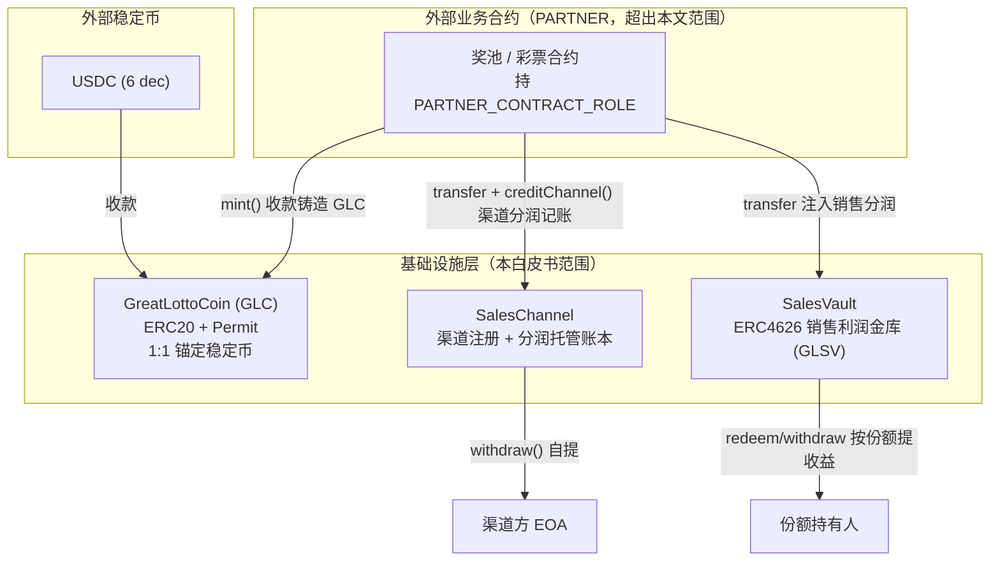

# GreatLottoGroup 基础设施合约白皮书

**Infrastructure Contracts Whitepaper**

| 项目 | 说明 |
|---|---|
| 文档版本 | v1.0 |
| 对应代码版本 | `@greatlotto/infrastructure` v0.1.3 |
| 依赖 | OpenZeppelin Contracts v5.6.x |
| 开源协议 | GPL-3.0 |
| 最后更新 | 2026-07-11 |

> **文档范围**：本白皮书聚焦 GreatLottoGroup 基础设施仓（`infrastructure`）中的**三个可部署顶层合约**——
> `GreatLottoCoin`（GLC）、`SalesChannel`、`SalesVault`。抽象基类层（`PrizePoolBase` /
> `EntropyConsumerBase` / `AccessControlPartnerContract` 等）作为支撑机制在相关章节简述，不单独展开；
> 下游业务合约（彩票 / 奖池）仅作为「PARTNER 调用方」抽象引用，其内部逻辑不在本文档范围内。

---

## 目录

1. [摘要](#1-摘要)
2. [背景与动机](#2-背景与动机)
3. [设计目标与原则](#3-设计目标与原则)
4. [系统架构总览](#4-系统架构总览)
5. [GreatLottoCoin（GLC）——资产币](#5-greatlottocoinglc资产币)
6. [SalesChannel——渠道注册表与分润托管账本](#6-saleschannel渠道注册表与分润托管账本)
7. [SalesVault——ERC4626 销售利润金库](#7-salesvaulterc4626-销售利润金库)
8. [经济模型](#8-经济模型)
9. [安全模型](#9-安全模型)
10. [治理](#10-治理)
11. [风险披露与免责](#11-风险披露与免责)
12. [术语表](#12-术语表)

---

## 1. 摘要

GreatLottoGroup 是一套构建在以太坊 L2（Base、Arbitrum One、Optimism 与 Unichain）上的链上博彩平台。**基础设施合约层**为平台提供三块可复用的底座能力：

- **资产结算币（GreatLottoCoin，GLC）**：把外部稳定币（当前为 USDC）按 1:1 价值封装为平台统一记账单位，屏蔽稳定币差异、并以「足额抵押」不变量约束其发行；
- **销售渠道分润托管（SalesChannel）**：渠道方链上自助注册，平台把渠道应得分润托管入账，渠道方按 pull-payment 模式自提，账本满足严格偿付能力不变量；
- **销售利润金库（SalesVault）**：基于 ERC-4626 的收益金库，平台销售分润直接注入以抬高每份额净值，份额持有人凭标准 `redeem` / `withdraw` 按比例提走收益。

三者共同构成平台的**资金入口—分润—收益分配**闭环底座。上层业务合约（彩票 / 奖池）通过 `PARTNER_CONTRACT_ROLE`（仅授合约、不授 EOA）调用 GLC 的收款铸造与 SalesChannel 的分润记账，将业务收入沉淀为可审计的链上账本。

本文档同时给出各合约的机制细节、经济模型、安全模型与治理边界，供技术尽调、集成方与审计前阅读。

---

## 2. 背景与动机

链上博彩 / 彩票类业务在资金侧存在三个共性痛点，基础设施层针对性地各自给出一个合约：

**1）稳定币结算的解耦。** 平台以外部稳定币（当前为 USDC，6 位小数）作为入金资产。若每个业务合约都直接处理稳定币的小数位与授权路径，会造成逻辑重复与错误面扩大。GLC 将「收哪种稳定币」与「业务如何记账」解耦：业务侧只面对单一 18 位精度的 GLC，稳定币差异被收敛在 GLC 一处处理，且白名单可按需扩展。

**2）渠道分润的信任与到账问题。** 平台通过销售渠道分发业务，渠道方需要一个**可验证、不可赖账、无需信任运营方手工打款**的分润通道。SalesChannel 以链上账本 + pull-payment 承载这一诉求：分润一旦入账即为渠道方的债权，渠道方随时自提，运营方无法挪用或拖延。

**3）平台收益的可持续分配。** 平台自留的销售利润需要一种「可持有、可增值、可赎回」的载体，而不是停在某个运营账户里。SalesVault 用 ERC-4626 把销售利润变成金库净值增长，份额即收益权凭证，赎回即变现。

---

## 3. 设计目标与原则

| 原则 | 落地方式 |
|---|---|
| **足额抵押** | GLC 的发行以底层稳定币实收为前提；`recover()` 只能把超额抵押铸给 owner，永不允许无抵押增发。 |
| **权限最小化 + 合约白名单** | 铸币 / 分润记账等敏感入口仅授 `PARTNER_CONTRACT_ROLE`，且 `grantRole` 强制被授地址必须是合约（`code.length > 1000`），杜绝 EOA 直接铸币 / 记账。 |
| **Pull payment 优先** | 渠道分润（SalesChannel）与金库收益（SalesVault）均由受益人主动提取，避免 push 付款失败阻塞主流程、以及向不可控地址主动转账的风险面。 |
| **严格资金不变量** | 每个持币合约都维护一条可链下验证的偿付能力不变量（见各章），转账采用「前置余额检查 + 后置严格等式校验」以捕获 silent-fail 与 fee-on-transfer 异常代币。 |
| **治理面收敛** | 可变治理项被刻意压缩：GLC 无暂停 / 无黑名单；SalesChannel 无资金后门；SalesVault 唯一特权是「硬上限内增铸份额」。降低治理密钥被滥用 / 被盗的爆炸半径。 |
| **防 delegatecall / 防重入** | 敏感函数统一挂 `noDelegateCall`；涉及外部转账的用户入口挂 `nonReentrant`，作为纵深防御。 |
| **标准优先** | 尽量复用 OpenZeppelin v5 的 ERC20 / ERC20Permit / ERC4626 / AccessControl / ReentrancyGuard / SafeERC20，减少自研密码学与状态机的攻击面。 |

---

## 4. 系统架构总览

### 4.1 合约关系



### 4.2 三合约职责边界

| 合约 | 一句话职责 | 是否持有资金 | 谁能改动其资金 | 受益人如何拿钱 |
|---|---|---|---|---|
| **GreatLottoCoin** | 稳定币↔GLC 的 1:1 封装与足额抵押发行 | 持有底层稳定币 | PARTNER 铸造 / 任何 GLC 持有者赎回 | `withdraw()` 销毁 GLC 换回稳定币 |
| **SalesChannel** | 渠道注册表 + 渠道分润托管账本 | 持有 GLC | PARTNER `creditChannel` 记账入账 | 渠道方 `withdraw()` 自提 |
| **SalesVault** | ERC-4626 销售利润金库 | 持有 GLC | 任意人可 `transfer` 注入（抬净值） | 份额持有人 `redeem`/`withdraw` |

### 4.3 共享基础组件

三个合约共用一批抽象基类 / 库（`contracts/base/`、`contracts/interfaces/`），是理解其安全属性的前提：

- **`AccessControlPartnerContract`**：`AccessControl` + `PARTNER_CONTRACT_ROLE`。构造时把 `DEFAULT_ADMIN_ROLE` 授给 `owner_`（为零地址则回退部署者），并重写 `grantRole`——授**任何角色**给零地址均 `revert ErrorZeroAddress`；仅当授 `PARTNER_CONTRACT_ROLE` 时才额外校验目标地址必须是合约（`_isContract`：`code.length > 1000`），否则 `revert ErrorInvalidAddress`；其余角色（含 `DEFAULT_ADMIN_ROLE`）不受合约校验约束，可授予 EOA / 多签。这是「敏感入口只授合约、不授 EOA」的强制点。
- **`NoDelegateCall`**：构造期记录本合约地址，运行时比对，阻止经 `delegatecall` 进入敏感函数（防止在代理上下文中篡改存储 / 记账）。
- **`DeadLine`**：`checkDeadline(deadline)` 修饰器，交易过期即 `revert`，用于带用户签名 / 时效语义的入口。
- **`SelfPermit`**：EIP-2612 标准 `permit` 入口（`selfPermit` / `selfPermitIfNecessary`），使 EOA 能在单笔交易内完成「授权 + 调用」。
- **`ReentrancyGuard` + `SafeERC20`**（OpenZeppelin）：重入保护与安全 ERC20 交互。

---

## 5. GreatLottoCoin（GLC）——资产币

### 5.1 定位

GLC 是平台的**统一记账 / 结算资产币**。它是一个标准 ERC-20（含 ERC-2612 Permit）代币，符号 `GLC`，**18 位小数**。其价值锚定为：**1 GLC = 1 单位底层稳定币**（如 1 USDC）。GLC 本身不产生收益、不做再抵押，仅承担「把 6 位小数稳定币折算封装成单一 18 位记账单位」的职责。

继承结构：
```
GreatLottoCoin is ERC20Permit, SelfPermit, AccessControlPartnerContract, NoDelegateCall, ReentrancyGuard, IGreatLottoCoin
```

### 5.2 支持的底层稳定币白名单

- 白名单 `_tokens` 由**构造参数**注入：`constructor(address[] tokensAddress_, address owner_)`。不再硬编码在源码、不按网络切注释——每条链在部署参数（`ignition/parameters/<network>.json` 的 `supportedTokens`）里填该链的稳定币地址。
- 生产环境当前仅支持 **USDC**。
- `checkToken(address)` 视图函数校验某地址是否在白名单内；非白名单币在收款路径直接 `revert ErrorUnsupportedToken`。

> **注**：白名单为构造期固定，合约**没有**运行时增删稳定币的 setter。如需变更支持币种，须重新部署 GLC。这是治理面收敛的一部分。

### 5.3 精度与换算

GLC 内部一律以 18 位小数记账，而底层稳定币多为 6 位。三个换算辅助函数厘清了单位：

| 函数 | 语义 | 公式 |
|---|---|---|
| `getAmount(uint amount)` | 整数「币个数」→ GLC wei（18 位） | `amount * 10**18` |
| `getAmount(address token, uint amount)` | 整数「币个数」→ 该稳定币 wei | `amount * 10**token.decimals()`（如 USDC 为 `amount*1e6`） |
| `getAmountWithDecimals(address token, uint amount)` | 稳定币 wei 余额 → 折算成 GLC wei | `amount * 10**(18 - token.decimals())`（USDC 为 `*1e12`） |

即：调用方以「整币个数 `amount`」为单位，合约据此分别算出应收的底层稳定币金额与应铸的 GLC 金额，二者价值 1:1、仅精度不同。

### 5.4 核心机制

#### （1）收款铸造 `mint`（仅 PARTNER）

```solidity
function mint(address token, uint256 amount, address payer) external onlyRole(PARTNER_CONTRACT_ROLE) returns (bool);
// 签名重载：先 EIP-2612 permit 再收款
function mint(address token, uint256 amount, address payer, uint deadline, uint8 v, bytes32 r, bytes32 s) external onlyRole(PARTNER_CONTRACT_ROLE) returns (bool);
```

流程（`_depositFor`）：
1. 校验 `token` 在白名单（否则 `ErrorUnsupportedToken`）；
2. 从 `payer` 用 `safeTransferFrom` 拉入 `getAmount(token, amount)` 的底层稳定币；
3. 向 **调用方合约（`_msgSender()`，即 PARTNER）** 铸造 `getAmount(amount)` 的 GLC；
4. 后置校验实际到账（`balanceBefore + underlyingAmount <= 新余额`），否则 `ErrorPaymentUnsuccessful`——捕获 silent-fail 类异常代币。

> 语义要点：GLC 铸给**调用它的业务合约**（PARTNER），而非 `payer`。业务合约代用户支付稳定币、拿到等值 GLC 后在自身逻辑中记账 / 分润。签名重载允许在同一笔交易内完成用户的 EIP-2612 授权，免去单独 approve。

#### （2）赎回 `withdraw`（公开）

```solidity
function withdraw(address token, uint256 amount) external nonReentrant returns (bool);
```

任何 GLC 持有者可销毁 `getAmount(amount)` 的 GLC，换回 `getAmount(token, amount)` 的指定白名单稳定币：先检查合约该币余额充足（否则 `ErrorInsufficientBalance`），`_burn` 调用者的 GLC，再 `safeTransfer` 稳定币，并后置校验实际支出。`nonReentrant` + `noDelegateCall` 双重防护。

> GLC 因此是**可随时 1:1 赎回**的封装币——只要合约持有对应稳定币储备。

#### （3）超额抵押回收 `recover`（仅 owner）

```solidity
function recover() external onlyRole(DEFAULT_ADMIN_ROLE) returns (uint256 value);
```

遍历白名单稳定币余额，用 `getAmountWithDecimals` 折算成 GLC 口径求和 `totalBalance`；若 `totalBalance > totalSupply()`，把差额（超额抵押 / 误转入的稳定币）铸给 owner。若无超额（`totalBalance <= totalSupply`），`revert GreatLottoCoinBaseNoNeedRecover`。

> 该函数**不会**破坏足额抵押：它只把「已实收但未对应任何 GLC」的多余储备变现为 GLC，铸后 `totalSupply` 仍 ≤ 折算总储备。

### 5.5 GLC 偿付能力不变量

> **不变量 I-GLC**：`Σ getAmountWithDecimals(tokenᵢ, balanceOf(tokenᵢ)) ≥ totalSupply(GLC)`

即所有白名单稳定币折算成 GLC 口径的储备总额，恒 ≥ 流通 GLC 总量。`mint` 先收后铸、`withdraw` 先烧后付、`recover` 只铸差额——三条路径都维持该不变量。任何时刻每一枚流通 GLC 都有 ≥1 单位稳定币储备背书。

### 5.6 访问控制与防护

- `mint`（两个重载）：`onlyRole(PARTNER_CONTRACT_ROLE)` + `noDelegateCall`；
- `withdraw`：`noDelegateCall` + `nonReentrant`（公开）；
- `recover`：`onlyRole(DEFAULT_ADMIN_ROLE)` + `noDelegateCall`；
- `grantRole` 被重写，PARTNER 角色只能授予合约地址；
- **无** `pause`、**无** 黑名单、**无** 任意增发——owner 唯一的资金侧特权是 `recover` 超额抵押。

### 5.7 事件与错误

| 事件 | 触发 |
|---|---|
| `GreatLottoCoinBaseWithdrawn(recipient, token, amount)` | 赎回成功 |
| `GreatLottoCoinBaseRecovered(value, totalSupply)` | 回收超额抵押 |

| 错误 | 含义 |
|---|---|
| `ErrorUnsupportedToken(token)` | 非白名单稳定币 |
| `ErrorPaymentUnsuccessful()` | 收 / 付款后置校验失败（异常代币） |
| `ErrorInsufficientBalance(token, account, balance, amount)` | 赎回时储备不足 |
| `GreatLottoCoinBaseNoNeedRecover(totalBalance, totalSupply)` | 无超额抵押可回收 |

---

## 6. SalesChannel——渠道注册表与分润托管账本

### 6.1 定位

SalesChannel 承担两件事：

1. **渠道注册表**：渠道方（EOA 或合约）链上自助注册，获得一个自增的 `chnId`，可随时改名；
2. **分润托管账本**：业务合约（PARTNER）把渠道应得的分润 GLC 转入本合约并按 `chnId` 记账，渠道方按 **pull payment** 自行提取。

继承结构：
```
SalesChannel is ISalesChannel, AccessControlPartnerContract, NoDelegateCall, DeadLine, ReentrancyGuard
```
本合约持有 GLC（`ICoinBase`），资产单位与 GLC wei 贯通。

### 6.2 渠道注册与改名

```solidity
function registerChannel(string name, uint256 deadline) external returns (bool);   // 一址一渠道，重复注册 revert
function changeChannelName(string name, uint256 deadline) external returns (bool);  // 仅本人改本渠道名
```

- `chnId` 从 `1` 开始自增（`_nextId`）；`chnId == 0` 语义上表示「无渠道」，被上下游用作「无渠道」哨兵值。
- 一个地址至多注册一个渠道（`SalesChannelAlreadyExists`）；未注册地址改名 `revert SalesChannelNotExists`。
- 两个入口都带 `checkDeadline` 时效保护与 `noDelegateCall`。

### 6.3 分润记账 `creditChannel`（仅 PARTNER）

```solidity
function creditChannel(uint256 chnId, uint256 amount) external onlyRole(PARTNER_CONTRACT_ROLE);
```

- **前置约定（MUST）**：调用方须**先**把等额 `amount` 的 GLC `safeTransfer` 入本合约，**再**调用 `creditChannel` 记账，且两者金额一致（「先转账后记账等额」）。
- 本函数**不校验到账**——它信任 PARTNER 已完成等额转账。因此 `PARTNER_CONTRACT_ROLE` **只授审计过、保证该顺序的业务合约，绝不授 EOA**。
- 记账即 `_accrued[chnId] += amount; _totalAccrued += amount;` 并 emit `SalesChannelCredited`。

### 6.4 自提 `withdraw`（渠道方，pull payment）

```solidity
function withdraw() external nonReentrant;   // 提到 msg.sender 自己，不接受任意 to
```

- 按 `msg.sender` 反查 `chnId`，可提金额 = `_accrued[chnId] - _withdrawn[chnId]`；为 0 则 `revert SalesChannelNothingToWithdraw`。
- 遵循 **CEI**：先更新账本（`_withdrawn` / `_totalWithdrawn`）再 `safeTransfer` GLC，配合 `nonReentrant` + `noDelegateCall`。
- 只能提给调用者自己，杜绝「提到任意地址」的授权面。

### 6.5 SalesChannel 偿付能力不变量

> **不变量 I-CH**：`balanceOf(GLC, SalesChannel) ≥ _totalAccrued − _totalWithdrawn`

`_totalAccrued` 仅在 `creditChannel` 自增、`_totalWithdrawn` 仅在 `withdraw` 自增；配合「PARTNER 先转账后等额记账」的前置约定，合约内 GLC 余额恒能覆盖所有渠道的待提总额。任一渠道随时可提尽其 `pendingOf`，不会出现挤兑失败。

### 6.6 账本查询与分页

| 视图 | 语义 |
|---|---|
| `pendingOf(chnId)` | 该渠道当前待提取（`accrued − withdrawn`） |
| `accruedOf(chnId)` | 该渠道历史累计入账（含已提） |
| `withdrawnOf(chnId)` | 该渠道历史累计已提 |
| `totalAccrued()` / `totalWithdrawn()` | 平台全局累计入账 / 已提 |
| `getChannelByAddr(addr)` / `getChannelById(chnId)` | 渠道正反查 |
| `getChannelCount()` | 渠道总数（`_nextId − 1`） |
| `getChannelsPaged(startId, count)` | 按 `chnId` 升序分页（单页上限 `MAX_CHANNEL_PAGE = 20`，超限 `SalesChannelPageTooLarge`） |

### 6.7 事件与错误

| 事件 | 触发 |
|---|---|
| `SalesChannelRegistered(addr, id, name)` | 渠道注册 |
| `SalesChannelNameChanged(addr, id, name)` | 渠道改名 |
| `SalesChannelCredited(id, amount)` | 分润入账（PARTNER） |
| `SalesChannelWithdrawn(id, chn, amount)` | 渠道方自提 |

| 错误 | 含义 |
|---|---|
| `SalesChannelAlreadyExists(addr)` / `SalesChannelNotExists(addr)` | 重复注册 / 渠道不存在 |
| `SalesChannelInvalid(addr)` | 无效渠道（分润时 `chnId` 不存在，由 PARTNER 侧触发） |
| `SalesChannelPageTooLarge(count)` | 分页超上限 |
| `SalesChannelNothingToWithdraw(chnId)` | 无可提分润 |

---

## 7. SalesVault——ERC-4626 销售利润金库

### 7.1 定位

SalesVault 是平台**销售利润的收益金库**，基于 OpenZeppelin ERC-4626 实现。资产币为 GLC，份额代币符号 `GLSV`（“GreatLotto Sales Vault”），份额即销售分润的**股权凭证**。

继承结构：
```
SalesVault is ERC4626, AccessControl
```

### 7.2 份额模型：1 亿硬上限，部署即铸满

- **份额硬上限** `MAX_SHARES = 100_000_000 × 1e18`（1 亿份，18 位小数，与 GLC 一致）。
- 构造函数把**全部 1 亿份**一次性铸给 `owner_`，并授予 `owner_` `DEFAULT_ADMIN_ROLE`。
- 因此**部署完成即处于「份额顶满」状态**：`maxMint` 返回 `MAX_SHARES − totalSupply()`，顶满即为 0。

### 7.3 收益增值机制：注入抬净值，不动份额

平台销售分润由业务合约（PARTNER）**直接 `safeTransfer` GLC 进金库**（不经 `deposit`）。这笔转账：

- **抬高** `totalAssets`（金库持有的 GLC 变多）；
- **不改变** `totalSupply`（份额数不变）。

结果：每一份 GLSV 对应的 GLC 净值（`convertToAssets(1 share)`）**按比例上涨**。份额持有人凭标准 ERC-4626 `redeem(shares)` / `withdraw(assets)` 按当前净值提走 GLC，无门槛、无锁定。

### 7.4 公众申购天然封死

`deposit` / `mint` 保持公开，但受 1 亿硬上限约束：

- `maxMint(addr)` 顶满时返回 0 → OZ 标准校验 `revert ERC4626ExceededMaxMint`；
- `maxDeposit(addr)` 由 `maxMint` 经现价 floor 换算，顶满即 0 → `revert ERC4626ExceededMaxDeposit`。

由于部署即顶满，**公众在正常状态下无法申购**——份额发行完全由 owner 掌控。这是刻意的经济设计：份额是平台内部分配的销售利润股权，不向公开市场增发。

### 7.5 唯一特权入口 `adminMint`

```solidity
function adminMint(uint256 shares, address receiver) external onlyRole(DEFAULT_ADMIN_ROLE);
```

- **设计意图**：份额持有人 `redeem` 提收益会**烧掉份额**，导致其占比下降。`adminMint` 允许 owner 在 `redeem` 腾出的额度内把份额补回给持有人，实现「**提了收益但不丧失股权**」。
- **不绕过硬上限**：复用 `maxMint(receiver)` 校验，`shares > maxMint` 即 `revert ERC4626ExceededMaxMint`；顶满时 `maxMint == 0`，任何增铸都会 revert。铸后 `totalSupply` 绝不超 `MAX_SHARES`。
- **免费铸**（不向 `receiver` 收对价）——因此有明确的安全用法约束（见 7.7）。

### 7.6 防通胀攻击（inflation attack）

`_decimalsOffset()` 覆写返回 `6`，引入 virtual shares/assets 偏移，抬高首存攻击者操纵单份额价格的成本。这是 ERC-4626 金库开放申购时的强制安全前提，即便当前公众申购被封死，也作为纵深防御保留。

### 7.7 治理边界与安全用法

SalesVault 的治理面被压到极小：

- **有** 的唯一特权：`adminMint`（硬上限内增铸份额）；
- **无** `adminBurn` / 没收持有人份额；
- **无** `sweep` / `rescue` 资金后门；
- **无** `pause`。

> ⚠️ **`adminMint` 安全用法**：仅在持有人 `redeem` 腾出额度后用于**补回股权**。**切勿**在金库尚有存量收益时给新地址免费增铸——那会按比例稀释、分走老持有人的既得收益。强烈建议 `owner_` 使用**多签**。

### 7.8 单位一致性

金库账本以底层 wei 级 GLC 计量，与 PrizePool 转入侧单位贯通——**不在金库内再做 `getAmount` 放大**。集成时注入的 GLC 金额即为 wei 口径。

---

## 8. 经济模型

### 8.1 资金流全景

```
用户支付稳定币(USDC)
        │  (业务合约代收，PARTNER 调 GLC.mint)
        ▼
  GreatLottoCoin ── 铸出等值 GLC 给业务合约
        │
        ▼
  业务合约(奖池) 按分润率拆分 GLC：
        ├── 渠道分润 ──transfer+creditChannel──▶ SalesChannel ──withdraw──▶ 渠道方
        ├── 销售分润 ──────transfer──────────▶ SalesVault(抬净值) ──redeem──▶ 份额持有人
        └── 净额(奖金池等) ── 留在业务合约按其逻辑处理(超出本文范围)
```

> 说明：分润率与拆分逻辑位于业务合约继承的抽象基类 `PrizePoolBase` 中（不在本文三合约范围内），此处仅为说明 SalesChannel / SalesVault 的**入账来源**而引用。

### 8.2 分润率（来自 PrizePoolBase，供理解入账口径）

| 分润档 | 出厂值 | 硬上限 | 可调性 |
|---|---|---|---|
| 渠道分润率 `channelBenefitRate` | **5%**（50‰） | `MAX_CHANNEL_BENEFIT_RATE = 50‰` | 构造期固定，**无运行时 setter**（增强渠道方信任） |
| 销售分润率 `sellBenefitRate` | **5%**（50‰） | `MAX_SELL_BENEFIT_RATE = 50‰` | 可经 `setSellBenefitRate` 调整，受同一硬上限约束；传 0 拒绝（`ErrorInvalidAmount`） |

- 分润以千分比计（`benefit = amount × rate / 1000`）。
- **无渠道**（`channelId == 0`）时，渠道分润档并入销售档，一起进 SalesVault。
- 两档各 ≤ 50‰，之和 ≤ 100‰ ≪ 1000，分润计算恒不下溢。

### 8.3 各方经济角色

| 角色 | 持有 | 收益来源 | 变现方式 |
|---|---|---|---|
| **用户** | — | — | 支付稳定币参与业务 |
| **渠道方** | SalesChannel 内的 `pendingOf` 债权 | 每笔带本渠道的业务交易的渠道分润 | `SalesChannel.withdraw()` 提 GLC，再 `GLC.withdraw()` 换稳定币 |
| **份额持有人** | GLSV 份额 | 销售分润注入抬高的金库净值 | `SalesVault.redeem/withdraw` 提 GLC |
| **平台 / owner** | 初始全部 GLSV 份额 | 销售利润（未分配给他人的份额部分） | 同份额持有人；可经 `adminMint` 管理份额分配 |
| **GLC 持有者** | GLC | 无收益（GLC 不生息） | `GLC.withdraw()` 1:1 赎回稳定币 |

### 8.4 中心化程度与信任假设（诚实披露）

- SalesVault 初始 100% 份额归 owner，公众无法申购；**平台销售利润的分配完全由 owner 通过份额发放/转让决定**。这是一个偏中心化的收益分配模型，其可信度直接取决于 owner 密钥的治理质量（故强烈建议多签）。
- 渠道分润相对去信任：一旦 `creditChannel` 入账即为渠道方链上债权，owner 无法撤销或挪用（SalesChannel 无资金后门）。
- GLC 的赎回权不依赖 owner：只要储备充足，任何持有者可 1:1 赎回。

---

## 9. 安全模型

### 9.1 访问控制矩阵

| 函数 | 合约 | 权限 | 附加防护 |
|---|---|---|---|
| `mint`（两重载） | GLC | `PARTNER_CONTRACT_ROLE`（仅合约） | `noDelegateCall` |
| `withdraw(token, amount)` | GLC | 公开 | `noDelegateCall` + `nonReentrant` |
| `recover` | GLC | `DEFAULT_ADMIN_ROLE` | `noDelegateCall` |
| `creditChannel` | SalesChannel | `PARTNER_CONTRACT_ROLE`（仅合约） | — |
| `registerChannel` / `changeChannelName` | SalesChannel | 公开 | `noDelegateCall` + `checkDeadline` |
| `withdraw()` | SalesChannel | 公开（提本人） | `noDelegateCall` + `nonReentrant` |
| `adminMint` | SalesVault | `DEFAULT_ADMIN_ROLE` | 复用 `maxMint` 硬上限 |
| `deposit/mint/redeem/withdraw` | SalesVault | 公开 | 硬上限 + virtual shares |

### 9.2 关键安全属性

1. **PARTNER 只授合约**：`AccessControlPartnerContract.grantRole` 强制被授地址 `code.length > 1000`，杜绝把铸币 / 记账权授给 EOA。
2. **偿付能力不变量**（三条，见 5.5 / 6.5 / SalesVault 的 ERC-4626 会计）：每个持币合约的储备恒覆盖其负债。
3. **严格转账校验**：GLC 的 `_depositFor` / `withdraw` 以及基类 `_transferTo` 采用「前置余额检查 + 后置严格等式」，捕获 silent-fail 与 fee-on-transfer 异常代币。
4. **Pull payment**：SalesChannel / SalesVault 均由受益人主动提取，push 失败不阻塞主流程、不向不可控地址主动付款。
5. **CEI + 重入保护**：所有「先改账本后转账」的路径都遵循 CEI，并叠加 `nonReentrant` 与 `noDelegateCall` 作为纵深防御。
6. **治理面收敛**：无暂停、无黑名单、无资金后门；owner 特权被压缩到 `recover`（GLC 超额）与 `adminMint`（份额硬上限内）两处非资金挪用型操作。

### 9.3 已知偏差与集成注意

- **`creditChannel` 信任 PARTNER 先转账**：SalesChannel 不校验 GLC 实际到账，依赖 PARTNER「先转账后等额记账」。这把安全性外推给了 PARTNER 合约的正确性——因此 PARTNER 必须审计，且角色绝不授 EOA。
- **`adminMint` 免费增铸的稀释风险**：见 7.7，须严格按「redeem 腾额后补回」使用。
- **白名单不可运行时变更**：GLC 支持币种在构造期固定，变更须重新部署。
- **`*Test` 变体**：若默认脚本引用带免费 `mintFor` 测试入口的 `GreatLottoCoinTest`，**主网上线前必须切回生产 `GreatLottoCoin`**，否则任何人可无抵押铸 GLC。

### 9.4 测试与形式化保障

- 合约测试全面迁移至 **Foundry**（`forge test`），全本地化、无需 fork（底层稳定币用 6 位 `MockERC20Permit` mock）。
- 覆盖单测 + **不变量测试（invariant）**，其中包含偿付能力类不变量的 fuzz 校验。
- 命令：`forge test`（全量）、`forge test --gas-report`（gas）、`forge coverage --report summary`（覆盖率）。

---

## 10. 治理

### 10.1 治理角色

- **`DEFAULT_ADMIN_ROLE`**（owner）：构造时授予 `owner_`（零地址回退部署者）。可授 / 撤 `PARTNER_CONTRACT_ROLE`，可调用 GLC `recover`、SalesVault `adminMint`、以及（下游 PrizePool 的）`setSellBenefitRate`。
- **`PARTNER_CONTRACT_ROLE`**：授予业务合约，使其可调 GLC `mint` 与 SalesChannel `creditChannel`。仅可授合约地址。

### 10.2 治理操作清单（本三合约范围内）

| 操作 | 合约 | 说明 |
|---|---|---|
| `grantRole(PARTNER_CONTRACT_ROLE, contract)` | GLC / SalesChannel | 上线业务合约时授权，仅合约地址 |
| `recover()` | GLC | 回收超额抵押 / 误转入的稳定币 |
| `adminMint(shares, receiver)` | SalesVault | 硬上限内补回 / 分配份额 |

### 10.3 治理最小化与多签

三合约刻意不设暂停、黑名单、任意增发、资金 sweep 等高危治理项，压缩 owner 密钥被盗 / 被滥用的爆炸半径。**主网 owner 强烈建议使用 Safe 多签**——尤其 SalesVault，因为 `adminMint` 的误用会稀释既有份额持有人收益。

---

## 11. 风险披露与免责

- **智能合约风险**：合约代码可能存在未被发现的缺陷。上线前应完成独立第三方安全审计；本白皮书不构成安全保证。
- **治理密钥风险**：owner 密钥若被盗，攻击者可授权恶意 PARTNER（进而铸 GLC / 记渠道账）、`recover` 超额抵押、`adminMint` 稀释份额。务必使用多签并妥善保管。
- **底层稳定币风险**：GLC 的价值锚定依赖底层稳定币（USDC）的稳定性与可赎回性；底层稳定币脱锚 / 冻结将传导至 GLC。
- **中心化风险**：SalesVault 初始份额 100% 归 owner，销售利润分配高度依赖 owner 的治理行为。
- **监管风险**：博彩 / 彩票类业务受各司法辖区监管，合约的可用性与合规性因地区而异。
- **免责声明**：本文档仅为技术与经济机制说明，不构成任何投资建议、要约或收益承诺。

---

## 12. 术语表

| 术语 | 含义 |
|---|---|
| **GLC** | GreatLottoCoin，平台资产结算币，1:1 锚定白名单稳定币，18 位小数 |
| **GLSV** | GreatLotto Sales Vault 份额代币（SalesVault 的 ERC-4626 份额） |
| **PARTNER** | 持 `PARTNER_CONTRACT_ROLE` 的业务合约（奖池 / 彩票），可调 GLC `mint` 与 SalesChannel `creditChannel` |
| **PARTNER_CONTRACT_ROLE** | 合约白名单角色，只能授予合约地址（非 EOA） |
| **Pull payment** | 受益人主动提取模式（与 push 主动付款相对），避免付款失败阻塞主流程 |
| **偿付能力不变量** | 持币合约「储备 ≥ 负债」的恒成立关系，可链下验证 |
| **CEI** | Checks-Effects-Interactions，先校验、再改状态、最后外部交互的安全编码顺序 |
| **inflation attack** | ERC-4626 首存者操纵单份额价格套利的攻击，靠 virtual shares 偏移防御 |
| **足额抵押** | 每枚流通 GLC 均有 ≥1 单位底层稳定币储备背书 |

---

